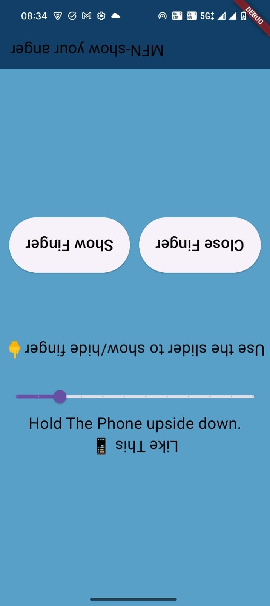
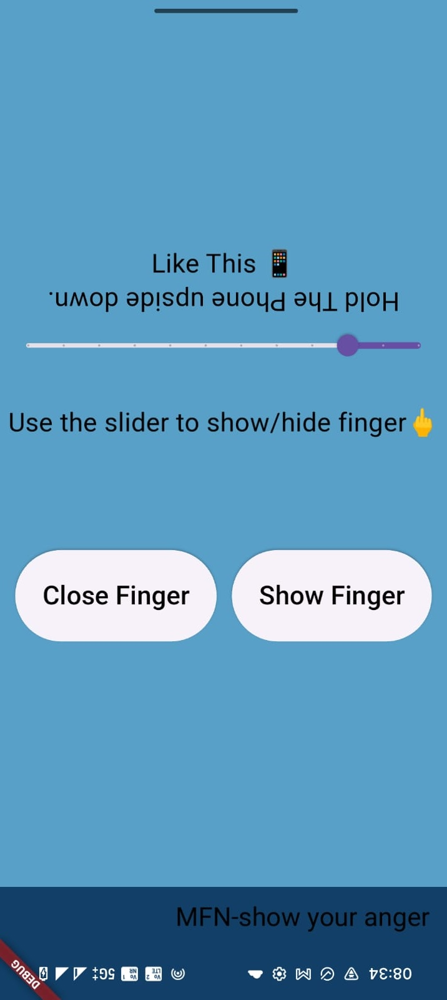
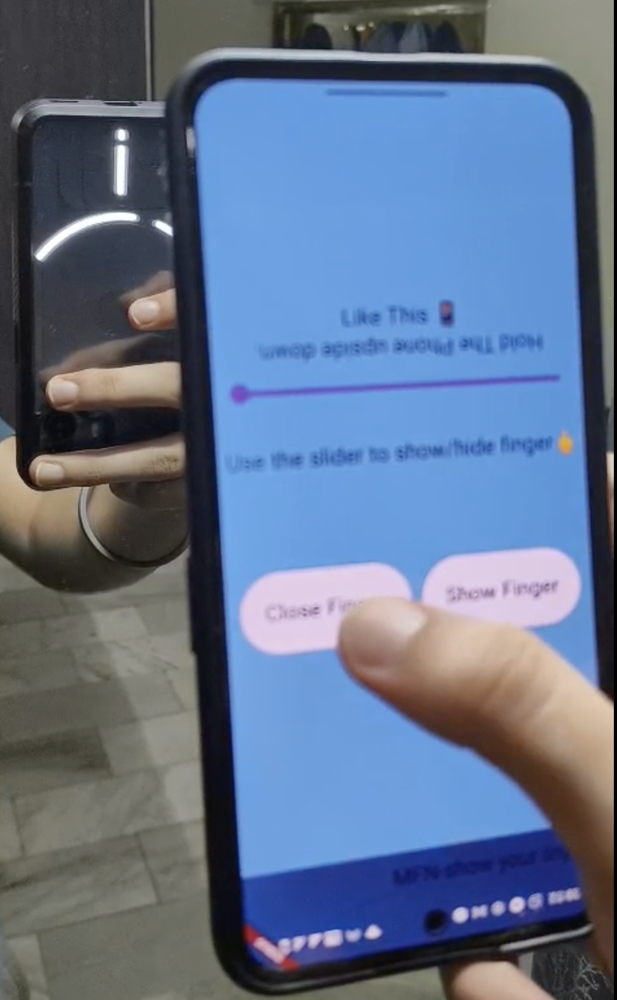

# MFN-Middle Finger Nothing
An apk to help you show your anger with glyph interface of Nothing Phone 2

##Demo:
<table>
<tr>
<td>

</td>
<td>

</td>
</tr>
</table>

<div>
      <a href="https://youtube.com/shorts/1fJ7_u69O6A">
         
      </a>
</div>


## How to install?
* First run below command for activating glyph on debugger mode
```bash
adb shell settings put global nt_glyph_interface_debug_enable 1
```
* Alternate (if you have nothing key neither ignore this)Add the following line of code in AndroidManifest.xml making sure you replace it with the test one.
```
<meta-data android:name="NothingKey" android:value="YOUR_KEY"/>
```

* Second, Connect your nothing phone 2 with your pc and run:
```
flutter run
```

A quote by me to forgive me for the project.
>Live the life with fun not to take everything so seriously. ~ Raman
